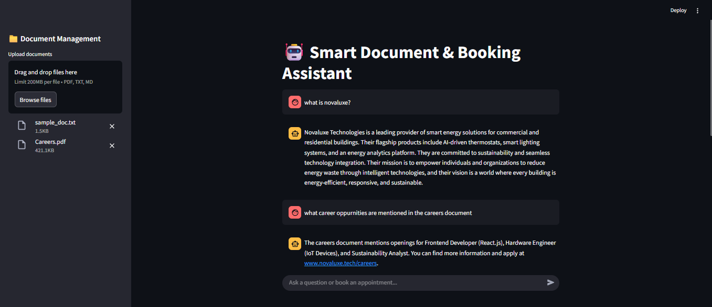
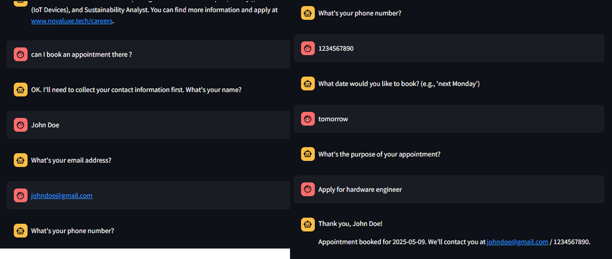

# Conversational-AI-Assistant-for-Document-Q-A-and-Smart-Appointment-Booking

A Conversational AI Assistant designed for Document Question & Answering and Smart Appointment Booking. This project enables users to interact with documents through natural language queries and efficiently manage appointment bookings via a smart conversational interface.

## Features

- Natural language question answering over uploaded documents (txt, pdf)
- Smart appointment booking through conversational interface
- Appointment details stored in json file
- Date parsing and validation for appointment scheduling
- Modular tools for booking logic and document processing
- User-friendly Streamlit-based UI for easy interaction

## Folder Structure
```
📂 Project-root/
├── requirements.txt         # All dependencies
├── ui_app.py                # Main Streamlit entry point
├── storage.py               # JSON storage functions (save_booking, load_bookings)
├── llm_setup.py             # LLM initialization
│
├── tools/
│   ├── __init__.py          # Package initialization
│   ├── document_qa.py       # Doc processing (PDF/TXT), embeddings, FAISS
│   ├── forms.py             # Tools for conversational form
│   ├── models.py            # ContactInfo/AppointmentDetails models
│   ├── validators.py        # parse_human_date, validate_contact_info
│ 
├── data/                    # Folder for storage
│   └── appointments.json    # Booking records
│
```
## Installation

Make sure you have **Python 3.10** installed. Then install the required dependencies using:
```bash
pip install -r requirements.txt
```


## Running the Application

To launch the application, run:
```bash
streamlit run ui_app.py
```
## Result


## Contribution

Contributions are welcome! If you want to contribute:

- Fork the repository
- Create a new branch for your feature or bugfix
- Submit a pull request describing your changes

Please ensure your code follows the existing style.

---

If you have any questions or feedback, feel free to reach out!
