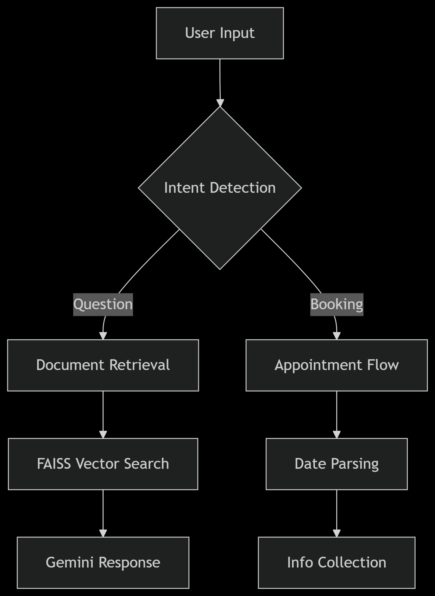

# Document Intelligence & Appointment Chatbot

<div align="center">
  
  
  
</div>

## Project Overview
A sophisticated AI assistant combining:
- **Document Intelligence**: Answer questions from PDFs/websites using RAG
- **Appointment Scheduling**: Natural language booking system
- **Data Validation**: Automatic verification of user inputs

## Features

### 📚 **Document Intelligence**
| Feature | Description | Example |
|---------|-------------|---------|
| **Multi-Format Support** | Process PDFs & web URLs | `policy.pdf`, `https://docs.example.com` |
| **Semantic Search** | Find answers using meaning, not just keywords | _"What's the late fee policy?"_ → Shows exact clause |
<!-- | **Citation Tracking** | Identify source pages/sections | _"From page 12 of the policy..."_ | -->

### 📅 **Appointment Management**
| Feature | Description | Tech Used |
|---------|-------------|-----------|
| **Natural Language Dates** | Understand casual time references | `"next Tuesday at 3"` → `2024-06-18 15:00` |
| **Multi-Step Booking** | Guided info collection | Name → Phone → Email → Confirm |
<!-- | **Calendar Sync** | (Coming Soon) | Google Calendar API | -->

### 🛡️ **Data Validation**
```python
# Example validation rules
class UserInfo(BaseModel):
    name: str
    phone: str
    email: EmailStr   # A emailstr datatype provided by Pydantic
    appointment_date: datetime
    
    @validator('phone')
    def validate_phone(cls, v):
        v = ''.join(filter(str.isdigit, v))  # Remove any non-digit characters
        if len(v) < 10:
            raise ValueError("Phone number must be at least 10 digits")
        return v
    
    @validator('appointment_date')
    def validate_future_date(cls, v):
        if v < datetime.now():
            raise ValueError("Appointment date must be in the future")
        return v
```

## Project File Structure

```bash
.
├── app/                   # Main application code
│   ├── main.py            # Entry point for the chatbot application
│   ├── chatbot.py         # Core chatbot logic and agent setup
│   ├── document_qa.py     # Document question-answering system
│   ├── appointment.py     # Appointment scheduling functionality
│   └── models.py          # Data models and validation schemas
│
├── data/                  # Data storage
│   └── documents/         # Directory for PDF/document storage
│       └── doc.pdf        # Example document (add your files here)
│
├── tests/                 # Test cases
│   ├── test_chatbot.py    # Unit tests for chatbot functionality
│
├── .env                   # Environment variables
    │     GOOGLE_API_KEY=api_key_here
    │     DOCUMENT_PATH=data/documents/doc.pdf
│
└── requirements.txt       # Python dependencies
    │   Core requirements:
    │   langchain
    │   langchain-google-genai
    │   python-dotenv
    │   pydantic
```
## Workflow
<div align="center">
  
</div>

## 🚀 Example Usage

### 1. Starting the Chatbot
```bash
# Run with default document
python app/main.py
# Specify a different PDF
python app/main.py --document data/documents/document_example.pdf
```

## Document Q&A Examples
```bash
User: What is the refund policy?
Bot: According to section 4.2, refunds are allowed within 30 days of purchase...

User: Show me the warranty details
Bot: The warranty covers manufacturing defects for 24 months:
     - Parts and labor included
     - Excludes accidental damage
     - Requires proof of purchase
```

## Appointment Booking Flow
```bash
User: I need to schedule a service appointment
Bot: When would you like to schedule? 

User: Next Thursday at 2pm
Bot: Got it. Please provide your full name.

User: Alex Johnson
Bot: Thank you! Your phone number?

User: 555-789-1234
Bot: Finally, your email address?

User: alex@example.com
Bot: ✅ Appointment Confirmed:
     📅 Date: Thu, Jun 20 at 14:00
     👤 Name: Alex Johnson
     📞 Phone: 555-789-1234
     📧 Email: alex@example.com
```

## Validation Examples
```bash
User: Book for yesterday at 5pm
Bot: ❌ Error: Date must be in the future

User: My email is alex@
Bot: ❌ Error: Invalid email format

User: Phone is 1234
Bot: ❌ Error: Phone must be 10 digits
```

